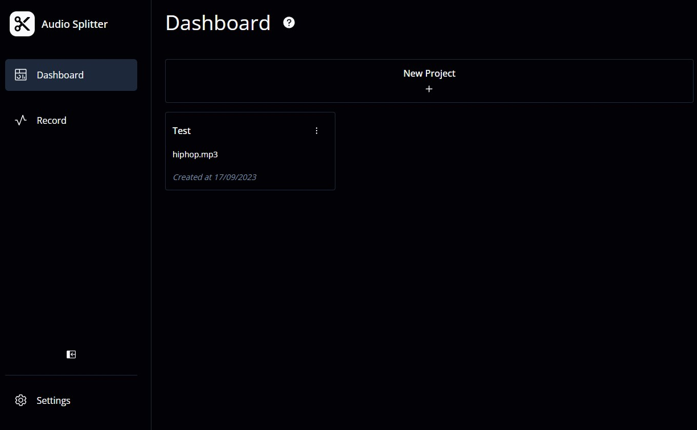
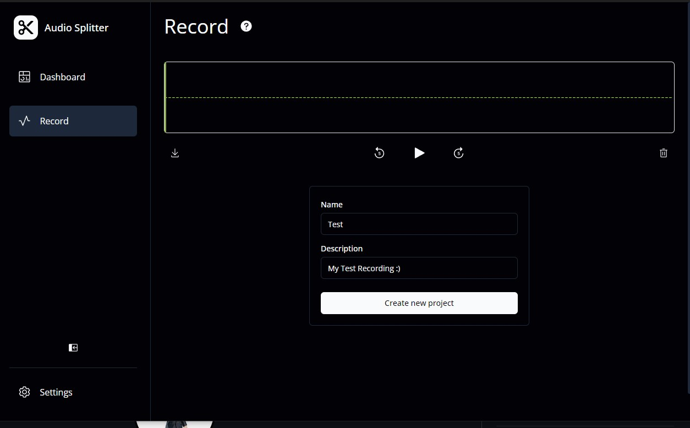
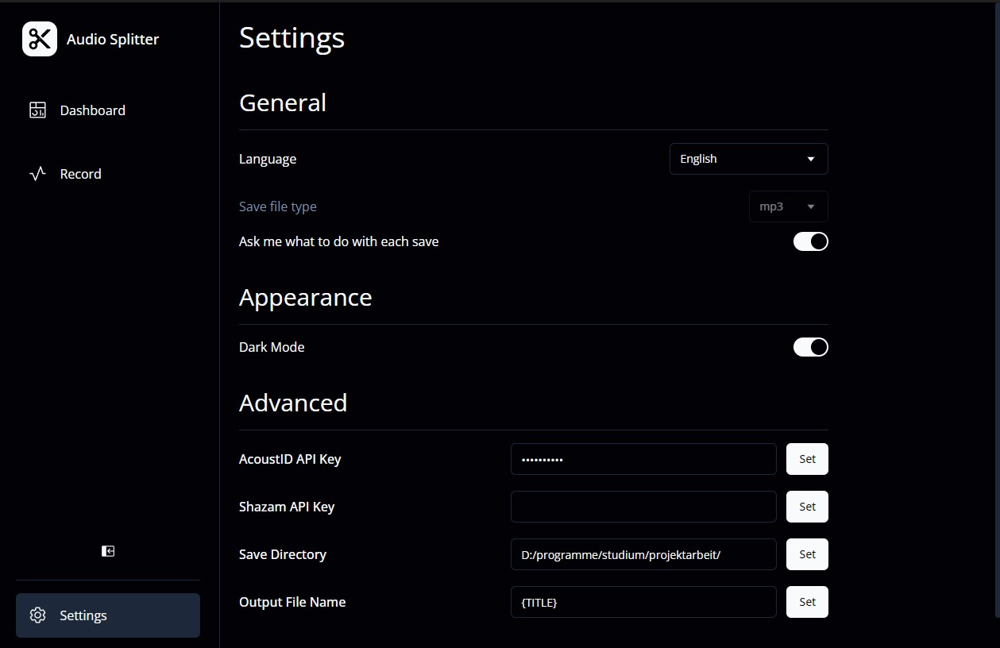

# AudioStreamSplitting

- [Audio Stream Splitting](#audiostreamsplitting)
  - [Using AudioStreamSplitting](#using-audiostreamsplitting)
    - [Setup](#setup)
    - [Usage](#usage)
      - [Quickstart](#quickstart)
      - [Project view](#project-view)
      - [Recording](#recording)
      - [Settings](#settings)
  - [License](#license)

AudioStreamSplitting is a tool designed to take long audio files including multiple songs (such as a recording of an LP), split the file up into the separate songs and add metadata (such as the song's title) to each of the songs if they can be identified.

For information on how to contribute to the development of AudioStreamSplitting, see [``CONTRIBUTING.md``](./CONTRIBUTING.md).

## Using AudioStreamSplitting

### Setup

1. Generate a valid API key for the [AcoustID](https://acoustid.org/) and/or [Shazam](https://rapidapi.com/apidojo/api/shazam) song recognition APIs. While this program can work if you only provide one of the two, it is strongly recommended to have both in order for the song identification to function properly. More song recognition APIs may be supported in the future. For the AcoustID API, you will need to register an application and use the application API key, rather than just the normal user API key. If you want to submit identified songs to the AcoustID API, you will also need the user API key.
2. Download the latest release of [`fpcalc`](https://acoustid.org/chromaprint) for your system from [the AcoustID website](https://acoustid.org/chromaprint) if you want to use the AcoustID API. Put it in a location of your choosing and add it to your system PATH.
3. Download the latest release of [`ffmpeg`](https://ffmpeg.org/download.html) if you want to use the in-app recording feature. Put it in a location of your choosing and add it to your system PATH.
4. If `ffmpeg` or `fpcalc` were not installed on your system prior to setup, you will probably need to restart your system first before using AudioStreamSplitting.
5. Download the latest release of AudioStreamSplitting from the "Releases" section of this site and run it.

### Usage

AudioStreamSplitting has three main areas, which you can switch between using the navigation bar on the side. The [Project view](#project-view), [Recording](#recording) and [Settings](#settings) page contain more detailed explanations of each area. If you just want to quickly get going to split a file, follow the [Quickstart](#quickstart) guide below.

If you encounter any bugs while running AudioStreamSplitting, please see if it has been already reported in the "issues" tab of this page. If it hasn't, please create a new issue report with a detailed description of your system and what went wrong so that it can be investigated and fixed.

#### Quickstart

After completing the steps from [Setup](#setup), to split up a file, do the following steps:

1. On the navigation bar on the right, click the "Settings" icon to enter the settings tab.
2. In the settings tab, enter the API Keys you generated during setup, and click the "Set" buttons next to their input fields to save them. Also enter the directory resulting files should be saved in in "Save Directory" and click the "Set" button next to that field.
3. If you want to, alter the file name template in "Output File Name". This will be used to name the single files after splitting. You can use the placeholders ``{TITLE}``, ``{ARTIST}``, ``{ALBUM}`` and ``{YEAR}``, which will be replaced by the corresponding data for the song you are saving. Once again click the "Set" button to save this.
4. Go back to the dashboard tab by clicking the "Dashboard" icon in the navigation bar.
5. Click "New" to create a new project, then give it a name and choose the file you want to split up. Click "Create" to finish creating the project.
6. Open your new project by clicking it, then click "Process" to process the file. This will take a while, so do not worry if it seems to be stuck here for a few minutes.
7. After processing is finished, you will see a list of songs the app detected.
8. If a song's data seems off to you, see if the "Edit" button (represented by the pen icon) is enabled (not greyed out). If it is, click it and choose the correct metadata.
9. Click the save button (represented by the arrow pointing down) to save the song. If everything went well, the song has now successfully been saved to the location you specified before. Alternatively use the "Save all" button to save all songs.

#### Project View

The project view (also called dashboard) contains all your projects. If you have not created any projects, it will be empty and prompt you to open a new project. If not, it will look like this:

You can click a project to open it, or click the three dots to edit or delete a project.

Opening a project will show a screen like this:

Clicking "Process" will attempt to split the file up and identify the songs the app discovers. This will take a while, so do not worry if it seems to be stuck for a few minutes after starting the processing.

The "Preset" drop-down allows you to choose between different sets of parameters for the splitting. You can usually leave this setting on "Normal", but if you notice excessive splitting errors, this can help alleviate them.

Once processing is done, you can see the songs discovered by the app, edit their metadata (as of current, this means choosing which of the metadata the app found might fit) and save them to your device. The "Save all" button will save every song.

If a bit of metadata says "unknown" (such as the "album" for "Hold The Line" in this example screenshot), that means the app couldn't identify it. Setting it manually is a planned feature for a future version.

#### Recording

The recording tab is used for the in-app-recording feature. Note that using this will require you to install FFMpeg first, as outlined in the [Setup](#setup) section.

Clicking the "record" button will start a recording. If you stop recording by clicking the button again, your screen will look like this:

The buttons below the waveform window allow you to download, play back or delete the recording. Below that, you can enter a name and a description to start a project from your recorded audio. Note that the splitting quality will suffer from a bad recording, so using this feature is only recommended if you can directly tap into the output of the device you are trying to record (e.g. the line output of a record player).

#### Settings

The settings tab allows you to configure AudioStreamSplitting to your liking. Each field has a short description below it to explain what it does:

The language field currently supports English, German, French and Spanish. Note that only the English and German translations are actively maintained, so translation issues will arise when using the other languages.

The "Save" section is where the settings related to saving files are situated.

The "Save Directory" setting should be set to the directory you want to save the resulting files into. Make sure that this is an existing directory on your device, as saving files will not work otherwise.

The "Output File Name" setting will control the file name of output files. You can include the placeholders ``{TITLE}``, ``{ARTIST}``, ``{ALBUM}`` and ``{YEAR}``, which will be replaced with the corresponding metadata when saving a song. As an example, saving the song "Thunderstruck" by "2Cellos" with the template ``"{TITLE}_{ARTIST}"`` will result in a file called ``"Thunderstruck_2Cellos.mp3"``. It is strongly recommended to include the ``{TITLE}`` placeholder in the file name to avoid overwriting files.

The "Submit files to APIs on save" setting controls whether files the app identified will also be sent to the AcoustID API (and potentially others in the future) to further improve their database. As far as we can tell, no personally identifying data is submitted, and the data that is submitted is only used to ensure you have access to the API. We kindly ask you to turn this setting on as the AcoustID database depends on user submissions to work as well as it does.

Turning off the "Ask me what to do with each save" option allows choosing a file type, which all files will be saved as by default. If this is not set, you will instead be asked to choose a file type every time you save a file.

The "Advanced" section is where the most important settings are situated. Note that for changes to these settings to apply, you must click the "Set" button next to the setting you changed.

You need to provide at least one API Key for the song identification to work, but it is strongly recommended to provide as many as possible (as outlined in the [Setup](#setup) section).

The AcoustID API keys are split into two keys: The "AcoustID Application API Key" is the key you receive when registering an application. This key is necessary for any functionality involving AcoustID. The "AcoustID User API Key" is only required if you also want to submit identified songs to AcoustID.

## License

This software is licensed under the GNU GPLv3 license, as found in the LICENSE.txt file or [on the GNU website](https://www.gnu.org/licenses/gpl-3.0.en.html). Note that this license only applies to the software itself, not to audio files generated by it, as they still belong to the songs' original copyright holders.

As another thing to note, commercial forks or uses of this software must [contact AcoustID here](https://acoustid.biz/) or remove support for the AcoustID API as AcoustID is only provided for free for non-commercial use.
